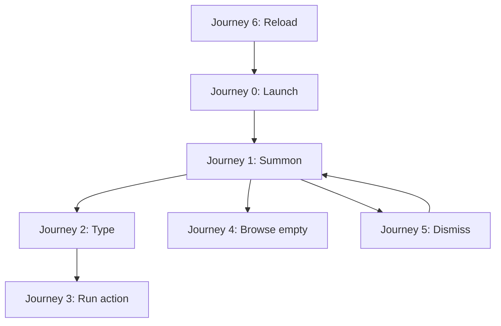
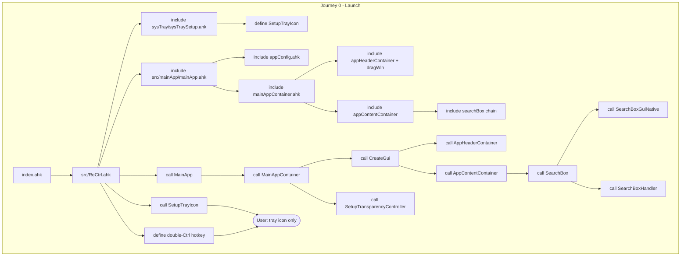
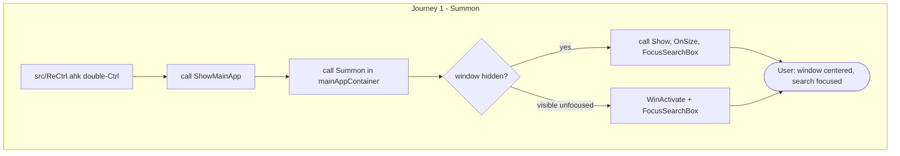
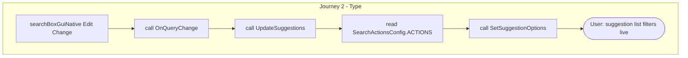
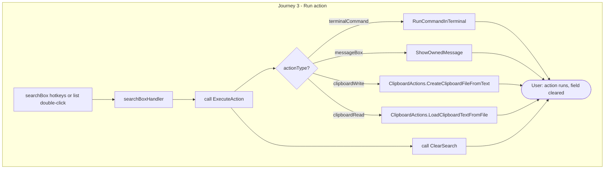
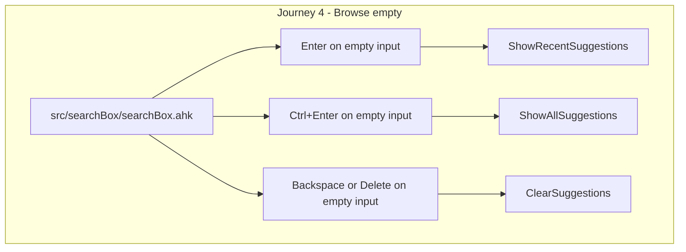
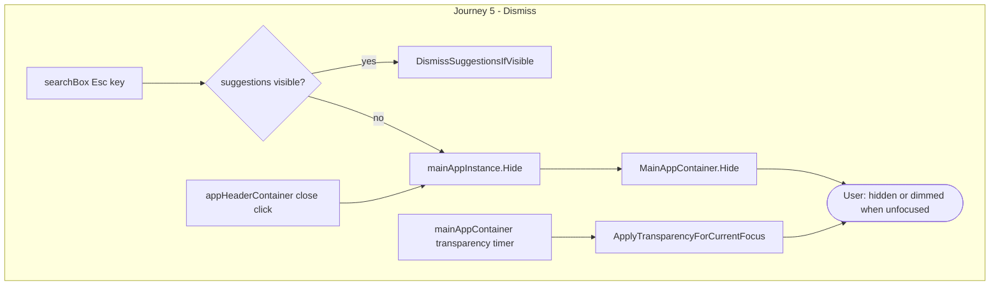
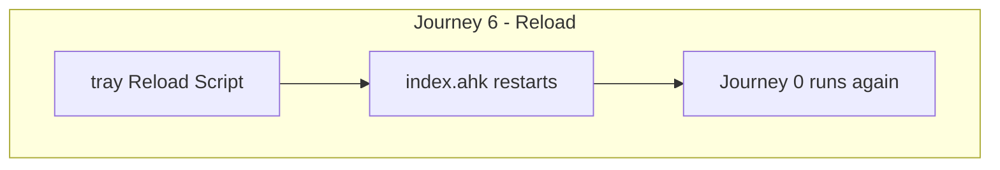

# ReCtrl — User Journey Code Flow

Reference doc for manual development: what is **included**, **defined**, and **called** at each user step.

**Legend**

| Mark | Meaning |
|------|---------|
| `[include]` | File merged via `#Include` at parse time |
| `{define}` | Class, function, or hotkey defined in that file |
| `(call)` | Runs at that point (runtime) |

**Paths** are relative to the repo root (`ReCtrl/`).

---

## Journey 0 — User launches ReCtrl

*User: runs `index.ahk` (shortcut / bat / direct)*

```
index.ahk
│
└─ [include] src/ReCtrl.ahk
    │
    ├─ [include] src/sysTray/sysTraySetup.ahk     {SetupTrayIcon}
    │
    ├─ [include] src/mainApp/mainApp.ahk          {MainApp} {ShowMainApp}
    │   ├─ [include] appConfig.ahk                {AppConfig} {AppColors}
    │   └─ [include] src/mainApp/mainAppContainer.ahk     {MainAppContainer}
    │       ├─ [include] src/mainApp/appHeaderContainer.ahk     {AppHeaderContainer}
    │       │   └─ [include] src/shared/dragWin.ahk      {DragWin}
    │       └─ [include] src/mainApp/appContentContainer.ahk  {AppContentContainer}
    │           └─ [include] src/searchBox/searchBox.ahk    {SearchBox} {#HotIf keys}
    │               ├─ [include] src/searchBox/configSearchBox.ahk      {SearchBoxConfig}
    │               ├─ [include] src/searchBox/searchActionsConfig.ahk  {SearchActionsConfig}
    │               ├─ [include] src/searchBox/actions/clipboardActions.ahk     {ClipboardActions}
    │               ├─ [include] src/searchBox/guiNative/searchBoxGuiNative.ahk   {SearchBoxGuiNative}
    │               └─ [include] src/searchBox/searchBoxHandler.ahk     {SearchBoxHandler}
    │
    ├─ (call) SetupTrayIcon()        ← uses definition from sysTraySetup
    │
    ├─ (call) MainApp()
    │   └─ (call) MainAppContainer()
    │       ├─ (call) CreateGui()
    │       │   ├─ (call) AppHeaderContainer()
    │       │   └─ (call) AppContentContainer()
    │       │       └─ (call) SearchBox()
    │       │           ├─ (call) SearchBoxGuiNative()   ← UI controls added
    │       │           └─ (call) SearchBoxHandler()     ← callbacks wired
    │       └─ (call) SetupTransparencyController()
    │
    └─ {define} ~Ctrl::  →  (call) ShowMainApp()  →  (call) Summon()

User sees: system tray icon only. Main window not shown yet.
Script state: idle, waiting for double-Ctrl.
```

---

## Journey 1 — User summons the app

*User: double-press Ctrl (within 400ms)*

```
src/ReCtrl.ahk
└─ {~Ctrl::} fires
    └─ (call) ShowMainApp()                   [mainApp.ahk]
        └─ (call) Summon()                    [mainAppContainer.ahk]
            ├─ if hidden → (call) Show()
            │   ├─ gui.Show("Center")
            │   ├─ (call) OnSize()            → header + search reposition
            │   └─ (call) FocusSearchBox()    [appContentContainer.ahk]
            │       └─ (call) SearchBox.Focus() [searchBoxGuiNative.ahk]
            │
            └─ if visible but unfocused → WinActivate() + FocusSearchBox()

User sees: ReCtrl window centered, cursor in search box.
```

---

## Journey 2 — User types to search

*User: types in search field*

```
src/searchBox/guiNative/searchBoxGuiNative.ahk
└─ {Edit Change event}
    └─ (call) OnQueryChange()
        └─ (call) SearchBoxHandler.UpdateSuggestions()   [searchBoxHandler.ahk]
            ├─ reads {SearchActionsConfig.ACTIONS}         [searchActionsConfig.ahk]
            ├─ matches label / command / keywords
            └─ (call) SetSuggestionOptions()
                └─ ListBox shown below input

User sees: filtered suggestion list updates as they type.
```

---

## Journey 3 — User picks an action

*User: Enter, Up/Down + Enter, or double-click suggestion*

```
src/searchBox/searchBox.ahk
├─ {#HotIf Enter} → (call) SubmitCurrent()
│   └─ (call) SearchBoxHandler.ProcessSearch()
├─ {#HotIf Up/Down} → (call) SelectRelative()
│   └─ (call) SearchBoxHandler.MoveSelection() → searchBoxGuiNative.MoveSelection()
└─ (via ListBox DoubleClick in guiNative) → ActivateSelectedOption()

src/searchBox/searchBoxHandler.ahk
└─ (call) ExecuteAction()
    ├─ actionType terminalCommand  → (call) RunCommandInTerminal()
    ├─ actionType messageBox       → (call) ShowOwnedMessage()
    ├─ actionType clipboardWrite   → (call) ClipboardActions.CreateClipboardFileFromText()
    ├─ actionType clipboardRead    → (call) ClipboardActions.LoadClipboardTextFromFile()
    └─ (call) ClearSearch()        [searchBoxGuiNative.ahk]

User sees: action runs (terminal / message / clipboard), search field cleared.
```

---

## Journey 4 — User browses without typing

*User: empty search box + special keys*

```
src/searchBox/searchBox.ahk
├─ Empty + Enter
│   └─ (call) ProcessSearch("") → ShowRecentSuggestions()
├─ Empty + Ctrl+Enter
│   └─ (call) ShowAllOptionsShortcut() → ShowAllSuggestions()
└─ Empty + Backspace/Delete
    └─ (call) OnEmptyEraseKey() → ClearSuggestions()

User sees: recent / all actions list, or suggestions cleared.
```

---

## Journey 5 — User dismisses / closes

*User: Esc, close button, or window loses focus*

```
src/searchBox/searchBox.ahk
└─ {Esc}
    ├─ suggestions visible → (call) DismissSuggestionsIfVisible()  (stay open)
    └─ else → (call) mainAppInstance.Hide()
        └─ (call) MainAppContainer.Hide()
            ├─ (call) HideTransientUi()  [searchBox]
            └─ gui.Hide()

src/mainApp/appHeaderContainer.ahk
└─ {closeBtn Click} → onClose → (call) MainAppContainer.Hide()

src/mainApp/mainAppContainer.ahk
└─ {transparency timer}
    └─ (call) ApplyTransparencyForCurrentFocus()
        └─ WinSetTransparent(active / inactive alpha from appConfig.ahk)

User sees: suggestions dismissed, or window hidden; dimmer when unfocused.
```

---

## Journey 6 — User reloads after code change

*User: tray icon → right-click → Reload Script*

```
index.ahk
└─ entire script restarts → Journey 0 runs again from top
```

---

## One-line story

Launch → tray only → double Ctrl → type/search → run action → Esc or close hides → reload restarts.

---

## Mermaid diagrams

Preview at [mermaid.live](https://mermaid.live) or in VS Code/Cursor with a Mermaid preview extension.

### Overview (all journeys)



### Journey 0 — Launch



### Journey 1 — Summon



### Journey 2 — Type to search



### Journey 3 — Run action



### Journey 4 — Browse empty input



### Journey 5 — Dismiss / close



### Journey 6 — Reload


